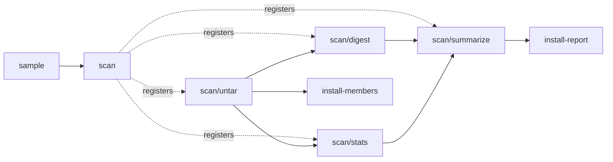

# Ninja dyndep archive extraction as dynamic build steps

This example unpacks a tar archive whose file list is unknown until the build runs, then processes the unpacked files. `build.ninja` is a real Ninja build that uses [dynamic dependencies](https://ninja-build.org/manual.html#ref_dyndep): the manual's *Tarball Extraction* example, plus edges that read the unpacked files. rattler-build runs the same graph as experimental `build.steps`: a scanner step declares the remaining Ninja edges as generated steps, and rattler-build runs those steps to do the extraction and processing. rattler-build does not run Ninja and does not need it. Ninja is useful here only to inspect the graph, as shown below.

| File | Contents |
| --- | --- |
| `build.ninja` | The Ninja graph: a scanner edge, an extraction edge and two consumers bound to the dyndep file, and an ordinary summary edge. |
| `archive_steps.py` | The command behind every Ninja rule, the sample archive, the `install-*` commands the recipe uses, and `export`, which adapts Ninja to rattler-build. Uses only the Python standard library. |
| `recipe.yaml` | Writes the sample archive, runs `export`, and packages what the generated steps produce. |

## The Ninja graph

```text
sample.tar ──scantar──▶ out/archive.dd                       (the dyndep file)
sample.tar ──untar────▶ out/archive.stamp   || out/archive.dd, dyndep = out/archive.dd
out/archive.stamp ──digest──▶ out/SHA256SUMS || out/archive.dd, dyndep = out/archive.dd
out/archive.stamp ──stats───▶ out/stats.json || out/archive.dd, dyndep = out/archive.dd
out/SHA256SUMS out/stats.json ──summarize──▶ out/summary.txt   (default target)
```

`build.ninja` names the archive but none of the files inside it. The `scantar` edge runs `archive_steps.py scan`, which reads the member list with `tarfile` and writes `out/archive.dd`. The three edges with `dyndep = out/archive.dd` list that file as an order-only input, so Ninja cannot start them before the scanner has finished. Once it has, Ninja loads the file and applies it to them. For the sample archive, the file is:

```ninja
ninja_dyndep_version = 1
build out/archive.stamp | $
    out/extract/sample/README.txt $
    out/extract/sample/data/bytes.bin $
    out/extract/sample/data/fibonacci.txt $
    out/extract/sample/data/primes.csv $
    out/extract/sample/docs/ninja$ dyndep.txt $
    : dyndep
  restat = 1
build out/SHA256SUMS : dyndep | $
    out/extract/sample/README.txt $
    out/extract/sample/data/bytes.bin $
    out/extract/sample/data/fibonacci.txt $
    out/extract/sample/data/primes.csv $
    out/extract/sample/docs/ninja$ dyndep.txt
build out/stats.json : dyndep | $
    out/extract/sample/README.txt $
    out/extract/sample/data/bytes.bin $
    out/extract/sample/data/fibonacci.txt $
    out/extract/sample/data/primes.csv $
    out/extract/sample/docs/ninja$ dyndep.txt
```

Each member becomes an implicit output of the `untar` edge, which produces it, and an implicit input of the `digest` and `stats` edges, which read it. This happens before any of those edges runs. `summarize` is an ordinary edge that runs after them.

### Inspecting it with Ninja

Work in a scratch copy, so Ninja's outputs stay out of the repository:

```sh
cp -R examples/dynamic-steps/ninja-archive /tmp/ninja-archive
cd /tmp/ninja-archive
python archive_steps.py sample sample.tar    # or copy another archive to sample.tar
ninja out/archive.dd                         # runs only the scanner edge
cat out/archive.dd
ninja -t query out/SHA256SUMS                # the members are now implicit (|) inputs
ninja -t graph out/summary.txt > graph.dot   # the graph including every discovered path
dot -Tsvg graph.dot -o graph.svg             # optional, needs Graphviz
```

`ninja -t query` and `ninja -t graph` load a dyndep file that already exists, so after `ninja out/archive.dd` both show the paths the scanner found, such as `out/extract/sample/docs/ninja dyndep.txt`. Before that, they show only the edges in `build.ninja`.

`build.ninja` runs `python`; set `python = python3` if that is the interpreter's name on your system. Without a local Ninja and Python, prefix the `python` and `ninja` commands with `pixi exec --spec ninja --spec python`. In PowerShell, use `Copy-Item -Recurse` and `$env:TEMP` instead of `cp -R` and `/tmp`, and `Get-Content` instead of `cat`.

To see the manifest rattler-build would receive for this graph, run the adapter directly. Like `ninja out/archive.dd`, it runs only the scanner edge, and then writes the four remaining edges as steps instead of running them:

```sh
python archive_steps.py export build.ninja --manifest out/steps.json --inputs out/inputs.json
```

## Running it with rattler-build

```sh
rattler-build build --experimental --recipe examples/dynamic-steps/ninja-archive/recipe.yaml
```

Add `--keep-build` to keep the work directory. It then contains `out/`, and the manifest and input report `scan` wrote stay in its artifact directory under `conda_build_steps/`.



1. `sample` writes `sample.tar` deterministically: five files with fixed contents, modification times and owners, one of them with a space in its name.
2. `scan` runs `archive_steps.py export build.ninja --set "archive=sample.tar"`. `export` does Ninja's work up to loading the dyndep file. It parses `build.ninja` (with `archive` overridden), runs the scanner edge's command as Ninja would, then reads back the `out/archive.dd` it just wrote, using Ninja's dyndep rules. It does not run the other edges. It writes them to `$RATTLER_BUILD_STEP_MANIFEST` as generated steps, and writes the files it read (`build.ninja`, `sample.tar` and `archive_steps.py`) to the input report `$RATTLER_BUILD_STEP_INPUTS`. Both the manifest and `out/archive.dd` come from the same scan of the archive, so they cannot disagree.
3. After `scan` succeeds, rattler-build validates the manifest and registers the steps `scan/untar`, `scan/digest`, `scan/stats` and `scan/summarize`. It checks that every member path has a single owner before `scan/untar` runs, so the five files are known outputs of `scan/untar` before the extraction starts. `scan/untar` unpacks the archive, `scan/digest` and `scan/stats` then run in parallel, and `scan/summarize` runs last.
4. `install-members` copies the unpacked files to `$PREFIX/share/ninja-archive/files`. `install-report` copies `summary.txt`, `SHA256SUMS` and `stats.json` to `$PREFIX/share/ninja-archive`.

The package tests check that `files/`, `SHA256SUMS` and `stats.json` list the same files, that every installed file has the checksum and size recorded for it, and that the summary counts the same number of files.

### `discover_after` and `depends_on`

Both installation steps read files that only generated steps write, so each has to wait for `scan` in some way. Otherwise the step graph would find no producer for those inputs and start the step immediately, when they are missing or left over from an earlier build.

- `install-members` uses `discover_after: [scan]`. It waits until `scan` has registered its generated steps, not until they finish. From then on its inputs have a known producer, `scan/untar`, so it starts once `scan/untar` is done, while `scan/digest` and `scan/stats` may still be running.
- `install-report` uses `depends_on: [scan]`. On a step that generates steps, `depends_on` waits for everything that step generated, recursively. The step also declares the files it reads as `inputs`.

## From Ninja to rattler-build

| Ninja (`build.ninja`, `out/archive.dd`) | rattler-build |
| --- | --- |
| Source file `sample.tar`, `archive_steps.py` | Output of the `sample` step, a recipe source |
| Scanner edge `build out/archive.dd: scantar ...` | Run by the static `scan` step, whose static output is `out/archive.dd` |
| Every other edge needed for the `default` targets | A generated step of `scan`, named after its rule (`rule.1`, `rule.2`, ... if a rule has several edges); `scan/untar` from outside the manifest |
| Evaluated `command`, with `$in`/`$out` quoted as Ninja quotes them | `run`, executed in the work directory by the native step shell, from the same activated environment as every other step |
| Explicit and implicit inputs, and the `\| imp-ins` of the dyndep file | `inputs`, each `{root: work, path: ...}` |
| Explicit and implicit outputs, and the `\| imp-outs` of the dyndep file | `outputs`, each `{root: work, path: ...}` |
| Order-only input `\|\| out/archive.dd` with `dyndep = out/archive.dd` | Nothing to declare: a generated step exists only once `scan` has written and loaded the dyndep file |
| Other order-only input built by an exported edge | `depends_on` that sibling step |
| `restat = 1` | Dropped, as rattler-build does not decide what to run from modification times |
| Nothing | `discover_after` / `depends_on` of static recipe steps that read generated outputs |

Ninja's build directory maps to the work directory, which is where `build.ninja` is when the steps run. A path outside it cannot be declared and fails the export.

## Unpacking another archive

The `archive` context variable names the archive, relative to the work directory. The `sample` step only runs while it is `sample.tar`. To unpack another archive, put it next to a copy of the recipe, where the `path: .` source copies it into the work directory, and point `archive` at it. For example, to unpack the sources of `rattler_build_script` from a checkout of rattler-build:

```sh
cp -R examples/dynamic-steps/ninja-archive /tmp/ninja-archive-sources
tar -czf /tmp/ninja-archive-sources/sources.tar.gz -C crates/rattler_build_script src
```

Then set `archive: sources.tar.gz` in the `context` of `/tmp/ninja-archive-sources/recipe.yaml` and build the copy:

```sh
rattler-build build --experimental --recipe /tmp/ninja-archive-sources/recipe.yaml
```

The package then contains `share/ninja-archive/files/src/...`, and its tests check those files. In PowerShell, use `Copy-Item -Recurse` and `$env:TEMP`; `tar` ships with Windows 10 and later. To inspect the graph of another archive with Ninja, set `archive = <path>` in `build.ninja` instead, or copy the archive to `sample.tar`.

The recipe passes the archive name to `export` in double quotes, so it may contain spaces and characters such as `&`, `^` or `(`, both in bash and in cmd.exe. It may not contain `"`, and bash would still expand `$` and `` ` `` in it, and cmd.exe `%`.

The archive may be uncompressed, gzip, bzip2 or xz. `scan` and `extract` accept only regular files and directories with relative names that every platform can store. They fail the build on symbolic or hard links, devices, absolute names and `..` components. They also reject names containing control characters or any of `<>:"|?*\`, names with a component ending in a dot or a space, Windows device names (`CON`, `NUL.txt`, ...) and DOS short names (`FOO~1.TXT`). Two members may not name the same path when case is ignored, and a file may not also be the parent directory of another member. Empty directories are not recreated, and permissions become `0644`, or `0755` for executable members.

## What `export` supports

`export` is an adapter for this kind of graph, not a general Ninja implementation. It fails with a message naming the file and line of anything outside the following, instead of skipping it.

- Supported: top-level variables (`--set` overrides them), `rule` with `command`, `description`, `dyndep` and `restat`, `build` statements with explicit and implicit outputs, explicit, implicit and order-only inputs and bindings, and `default`. Paths and commands follow Ninja's escaping (`$$`, `$ `, `$:`, `$` line continuations), variable scoping and `$in`, `$in_newline` and `$out` quoting. On Windows, `$in` and `$out` also quote a path containing any of `&|<>^()`, which cmd.exe would otherwise interpret; the program receives the same argument as from Ninja. Dyndep files follow Ninja's format and checks: version 1, one statement per edge bound to the file, implicit outputs and inputs, and `restat`.
- Rejected: `include`, `subninja`, `pool`, `phony` edges, validations (`|@`), the variables `depfile`, `deps`, `msvc_deps_prefix`, `rspfile`, `rspfile_content`, `pool` and `generator` in a rule, a build statement or the top level, and any other rule variable. A path outside the directory of `build.ninja` cannot be declared as a step input or output and fails the export.
- Only the edges needed for the `default` targets are exported, or those needed for every target no edge reads if there is no `default`.
- Scanner edges, the ones writing a dyndep file, must only read files that exist before the build, and cannot have a dyndep binding of their own. They all run inside the `scan` step. A generated edge that produced another dyndep file would need another scanner step. rattler-build supports generated steps that generate further steps, but this adapter does not use that.
- The generated commands run in the native step shell (bash, or cmd.exe on Windows) instead of `/bin/sh -c` or `CreateProcess`. Plain program invocations like the ones in this `build.ninja` behave the same in both. On Windows, where Ninja passes a command to `CreateProcess` unchanged, cmd.exe would interpret parts of it, so `export` fails with the file and line of the edge if a command contains `%` or a line break (as `$in_newline` writes), or any of `&|<>^` outside double quotes. `$in` and `$out` quote their paths, so only a `%` in a path fails, while these operators fail only where the rule or its bindings write them unquoted.
- `restat` is dropped, and nothing is rebuilt based on modification times: rattler-build runs every step of every build.

## Limitations

- The dyndep file, the manifest and the input report are the files a step cache has to restore for `scan`. Caching is not implemented yet: every build runs every step.
- This example has a single generator. Interleaving between two generators (generator G's step A, then generator H's step B, then G's step C) and recursive expansion are covered by rattler-build's tests in `crates/rattler_build_script/tests/dynamic_steps.rs`, not by this example.
